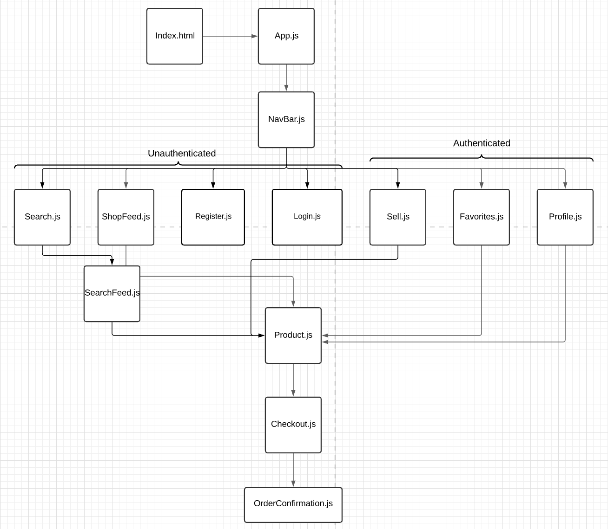
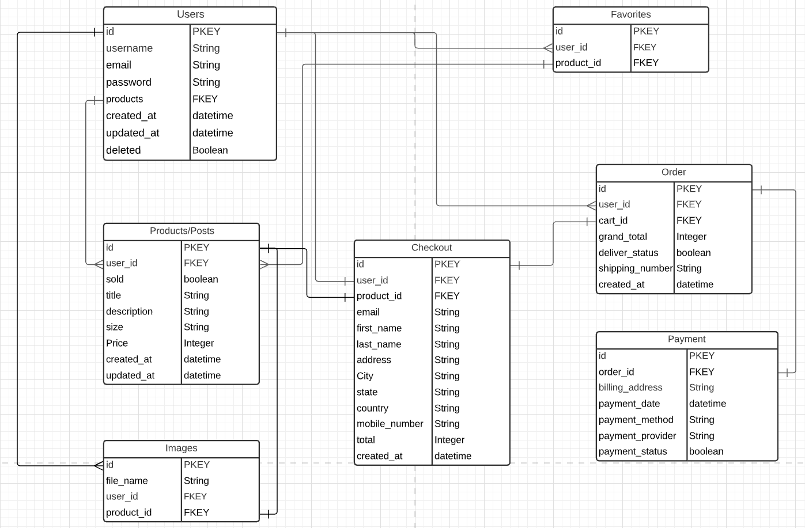

# Gently Used

### Author: Wei Jun Xia

### Date: 10/11/2021

### LINKS: [Live Demo](https://peaceful-coast-61697.herokuapp.com/) | [GitHub](https://github.com/weijunxia/gentlyused) | [Pitch Deck](https://docs.google.com/presentation/d/1E6WKr777mmTI7fFAKNvG-PAAhl4XrJkNEqUaE-0FxXc/edit?usp=sharing) | [Trello](https://trello.com/invite/b/2InlilO8/7a9c24c4377a3124cd959062db9761ed/gentlyused)
_______

## 👖 🛒 About 
Gently Used is a second hand clothing marketplace, built with a Vue.js front-end, Node.js, Express.js and PostgreSQL back-end. Amazon S3 used for image hosting, PayPal and Stripe used for checkout. 

## 📊 Component Hierarchy Diagram

## 📊 Entity Relationship Diagram

## 📸 Screenshots
### Home Page

### Register Page

### Signin Page

## 🗓 Future Updates

- [ ] Blog's to sell and feature user's products
- [ ] Commenting for posts
- [ ] Messaging between users
- [ ] Search Functionality 

## 📖 Credits
- [Loading.io](https://loading.io/) for loading pages
- [Sam Meech-Ward](https://www.youtube.com/watch?v=yGYeYJpRWPM) for the tutorial on Amazon S3 configuration.
- [Marcus Michaels](https://medium.com/@marcusmichaels/how-to-build-a-carousel-from-scratch-in-vanilla-js-9a096d3b98c9) DIY carousel
