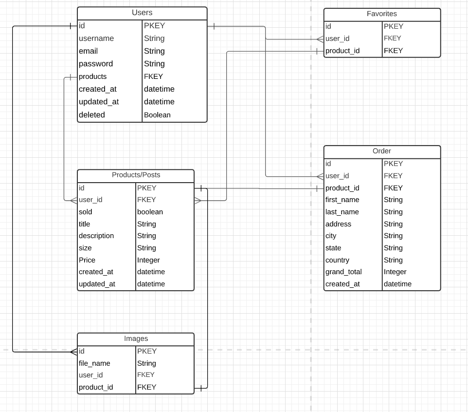

# Gently Used

### Author: Wei Jun Xia

### Date: 10/11/2021
_______

## 👖 🛒 About 
Gently Used is a second hand clothing marketplace, built with a Vue.js front-end, Node.js, Express.js and PostgreSQL back-end. Amazon S3 used for image hosting, PayPal and Stripe used for checkout. 

My [Trello](https://trello.com/invite/b/2InlilO8/7a9c24c4377a3124cd959062db9761ed/gentlyused) Board to keep track of my progress.

Google Slides [Pitch Deck](https://docs.google.com/presentation/d/1E6WKr777mmTI7fFAKNvG-PAAhl4XrJkNEqUaE-0FxXc/edit?usp=sharing).

## 📊 Component Hierarchy Diagram

## 📊 Entity Relationship Diagram

## 📸 Screenshots
### Home Page

### Register Page

### Signin Page

## 🗓 Future Updates

- [ ] Blog's to sell and feature user's products
- [ ] Commenting for posts
- [ ] Messaging between users
- [ ] Search Functionality 

## 📖 Credits
